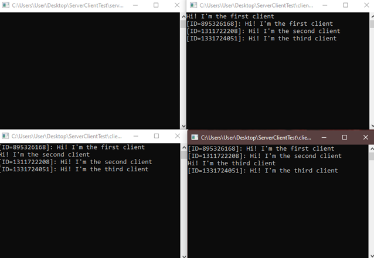

# Клиент-серверное приложение (примитивный чат)

## Описание проекта
Это тестовое клиент-серверное приложение, реализующее простой консольный чат.  
- Сервер может быть запущен только один.  
- Клиентов может быть запущено, сколько угодно.  
- Сообщение, отправленные в одном клиенте, отображаются во всех.  

## Как запустить  
1. Запустите сервер, используя файл `server.exe`.  
2. Запустите один или несколько клиентов, используя файл `client.exe`.  
3. Введите сообщение в консоли любого клиента — оно будет передано всем клиентам.  

## Системные требования  
- Windows OS (тестировалось на Windows 10).

--- 
